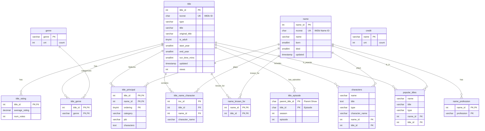

# IMDb ER Diagram

```mermaid
erDiagram
    title ||--o{ title_rating : "has"
    title ||--o{ title_genre : "has"
    title ||--o{ title_principal : "features"
    title ||--o{ title_name_character : "contains"
    title ||--o{ name_known_for : "known_for"
    title ||--o{ title_episode : "has_episodes"
    title ||--o{ characters : "includes"
    title ||--o{ popular_titles : "is_popular"

    name ||--o{ title_principal : "appears_in"
    name ||--o{ name_profession : "has"
    name ||--o{ name_known_for : "known_for"
    name ||--o{ title_name_character : "plays"
    name ||--o{ characters : "plays"
    name ||--o{ popular_titles : "is_in"

    genre ||--o{ title_genre : "categorizes"

    title {
        int title_id PK
        char tconst UK "IMDb ID"
        varchar type
        varchar title
        varchar original_title
        tinyint is_adult
        smallint start_year
        smallint end_year
        smallint run_time_mins
        timestamp updated
        int views
    }

    name {
        int name_id PK
        char nconst UK "IMDb Name ID"
        varchar name
        smallint born
        smallint died
        timestamp updated
    }

    title_rating {
        int title_id PK,FK
        decimal average_rating
        int num_votes
    }

    title_genre {
        int title_id PK,FK
        varchar genre PK,FK
    }

    genre {
        varchar genre PK
        int cnt "count"
    }

    title_principal {
        int title_id PK,FK
        int name_id PK,FK
        tinyint ordering PK
        varchar category
        varchar job
        text characters
    }

    name_profession {
        int name_id PK,FK
        varchar profession PK
    }

    name_known_for {
        int name_id PK,FK
        int title_id PK,FK
    }

    title_name_character {
        int tnc_id PK
        int title_id FK
        int name_id FK
        varchar character_name
    }

    title_episode {
        char parent_title_id PK "Parent Show"
        char title_id PK "Episode"
        int season
        int episode
    }

    characters {
        varchar name
        text title
        varchar type
        varchar character_name
        int name_id FK
        int title_id FK
    }

    popular_titles {
        varchar name
        varchar title
        varchar type
        int name_id FK
        int title_id FK
    }

    credit {
        varchar name PK
        int cnt "count"
    }
```
