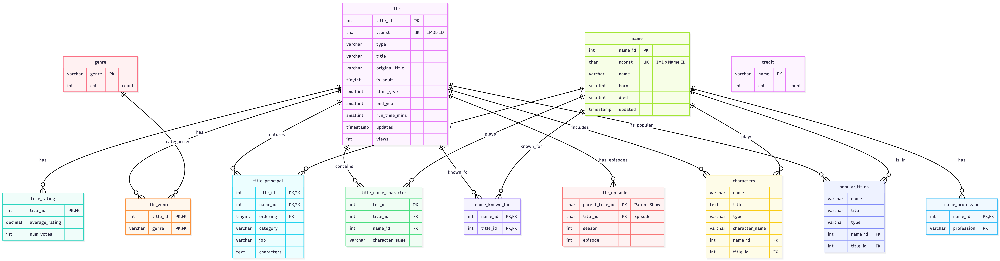

# Using a MCP server with a MySQL database

## Overview

We are using the following [MCP Server repo](https://github.com/askdba/mysql-mcp-server) from MySQL Community advocate Alkin Tezuysal to enable [Claude AI]([http://claude.ai) to speak directly with [MySQL](https://www.mysql.com).

## Prerequisites

This example does not work without first having:

- A MySQL installation. See [MySQL Downloads](https://www.mysql.com/downloads/)
- The Claude Desktop client. See [Installing Claude Desktop](https://support.claude.com/en/articles/10065433-installing-claude-desktop)

## Lessons

- [Lesson 1 - Installation and Configuration](INSTALL.md) One and Done instructions
- [Lesson 2 - Validate your MySQL access in Claude](VALIDATE.md)
 - Checkout the generated ERD and [Code](ERD.md) you can adjust at [Mermaid](https://mermaid.live/).
 
- [Lesson 3 - Querying Data](QUERY.md)
- [Lesson 4 - Visualizing Data](VISUALIZE.md)
- [Table Meta Data](META.md)
- [Using the API](API.md)
- [Leveraging the API](USING-API.md)
