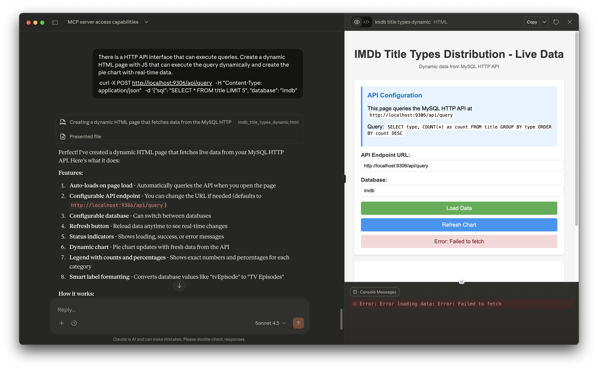

# Leveraging the API

As we have seen with the [HTTP interface](API.md), we can obtain real-time information from SQL queries as a JSON object.

What if we could incorporate that into the initial graphs we produced. The [earlier example](VISUALIZE.md) was a static version of the data. We can have GenAI produce HTML/JS that will dynamically populate this. The output is:


After a few deletes of data we can see an updated chart:


The html is included here [imdb_title_piechart.html](imdb_title_piechart.html)
You need to run this in a web container to avoid a CORS error.

1. Start a basic container
```
python -m http.server
```

2. In a separate session open the HTML
```
open http://localhost:8000/imdb_title_piechart.html
```

## How to reproduce this

This is a little more work, and some skills as an API prompt engineer helps.

Prompt `There is a HTTP API interface that can execute queries. Create a dynamic HTML page with JS that can execute the query dynamically and create the pie chart with real-time data.
 curl -X POST http://localhost:9306/api/query   -H "Content-Type: application/json"   -d '{"sql": "SELECT * FROM title LIMIT 5", "database": "imdb"`

The inline example failed to correctly render, which is should as it's running in a Claude environment.
It did correctly warn the unsuspecting user of a possible CORS issue.

*Note: The page uses fetch() which may encounter CORS issues if the API doesn't allow cross-origin requests. If you see CORS errors in the browser console, you'll need to configure your API server to send appropriateC ORS headers.*

 But then it went and said *To test it, just open the HTML file in a browser while your MySQL HTTP API is running on localhost:9306!* , which is not the way to correctly render the file as this produces a CORS error.



The execution also failed, but I simply provided the error, and the JSON response that was provided and it corrected an assumption of the format of the JSON response. A better prompt would have provided an example response in the original request.

 Prompt 2 `I get the error when running on a localhost Error: Invalid data format received from API
but the response is valid JSON

{
    "success": true,
    "data": {
        "columns": [
            "type",...`

I see the issue! The API response has the data nested inside a data object. Let me fix the code to handle this structure:

Perfect! I've fixed the issue. The code now properly handles the nested response structure where the rows are inside response_data.data.rows instead of directly in response_data.rows.
The updated code:

Checks for response_data.data.rows first (your API's structure)
Falls back to response_data.rows if needed (for compatibility)
Throws a clear error if neither structure is found

It should now work correctly with your API response! The chart will display the data from your localhost MySQL API.
