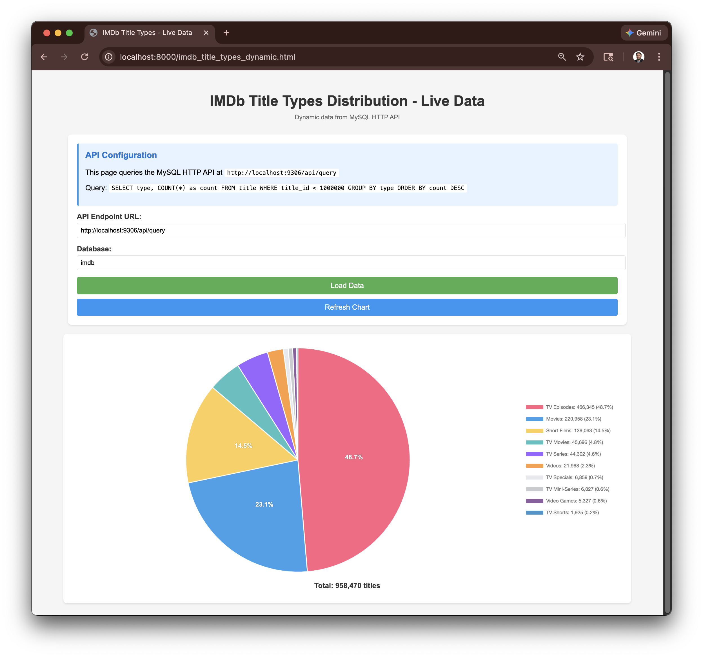
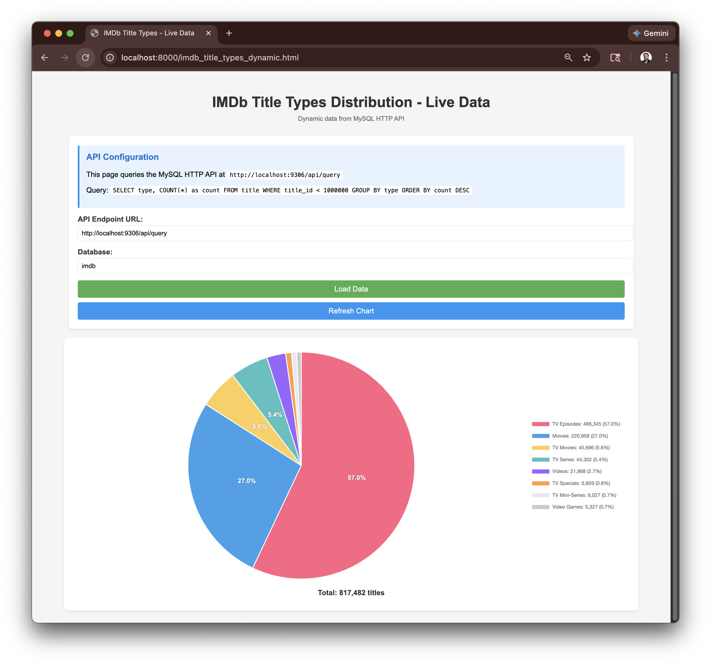

# Leveraging the API

As we have seen with a [HTTP interface](API.md), we can obtain real-time information from SQL queries.

What if we could incorporate that into graphs we produced. The [earlier example](VISUALIZE.md) was a static version of the data. We can have GenAI produce HTML/JS that will dynamically populate this.



After a few deletes we can see an updated chart.



The html is included here [imdb_title_piechart.html](imdb_title_piechart.html)
You need to run this in a web container to avoid a CORS error.

Start a basic container
```
python -m http.server
```

In a separate session open the HTML
```
open http://localhost:8000/imdb_title_piechart.html
```
