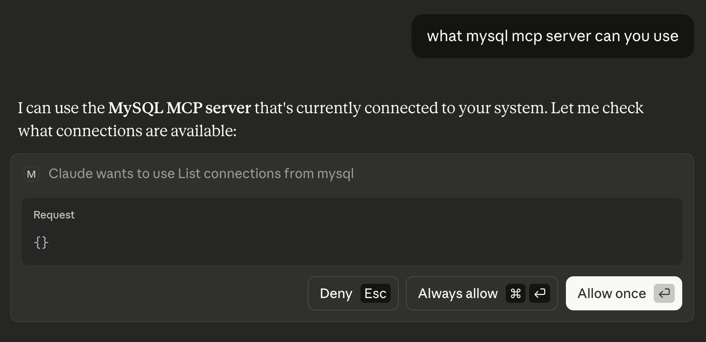
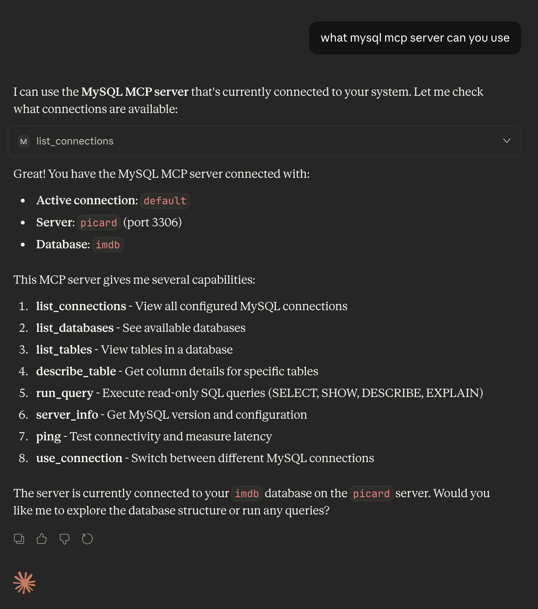
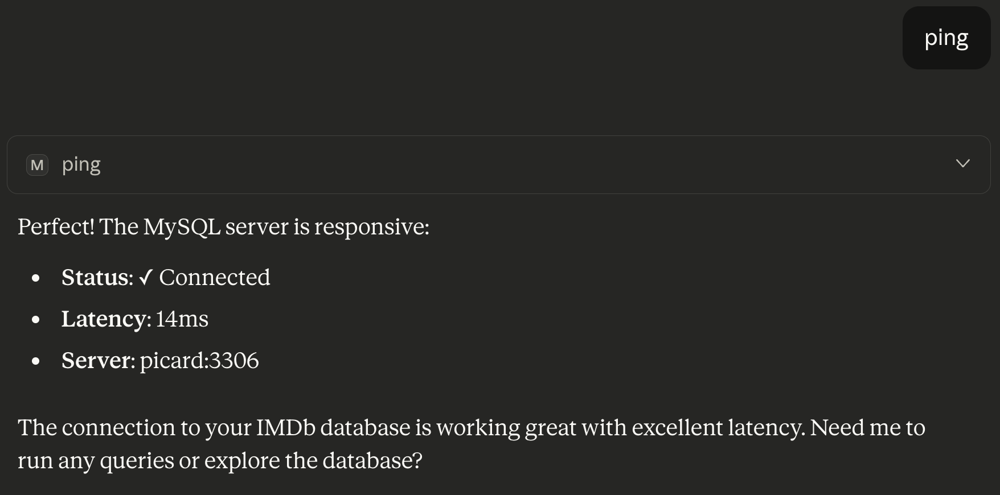
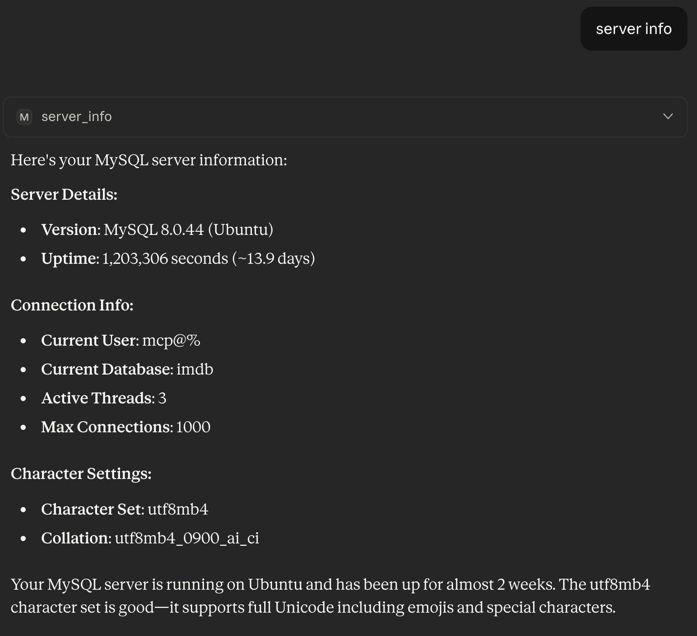
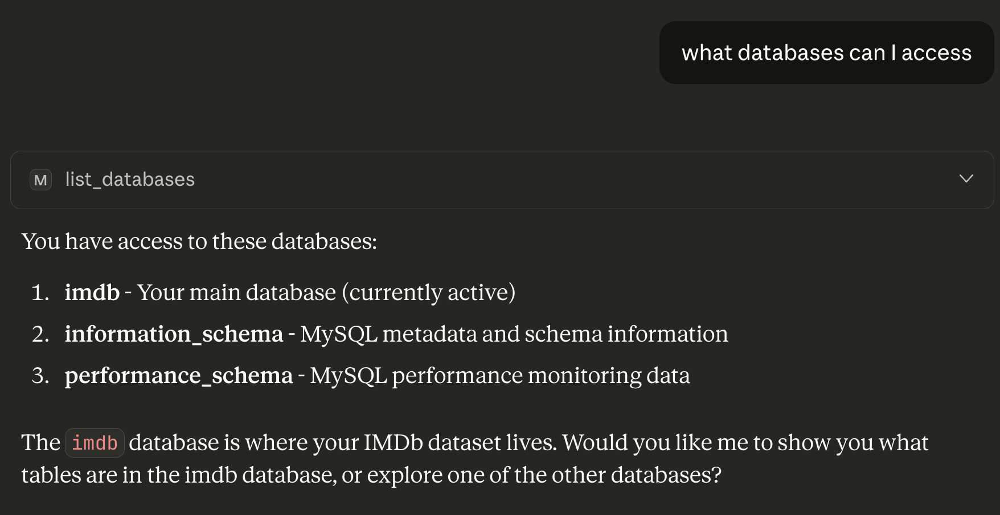
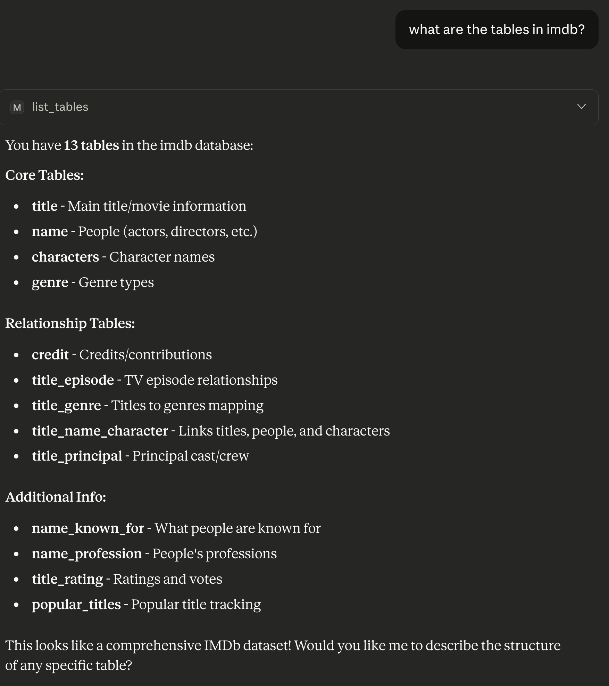

# Validating MySQL MCP with Claude

You should have completed the [Installation and Configuration](INSTALL.md) before moving forward.

## Next Steps

- Start a new chat in Claude.

## MySQL Configuration Validation

Prompt "`what mysql mcp server can you use`"

The first time Claude attempts to run each MySQL MCP command you will be prompted to approve.

## MySQL Operation

If you ran the first prompt and received an expected result, your discussion (or context) is already understanding MySQL, so you can immediate just be specific. Chat does not require verbose commands, or even correctly spelt commands. You do not need to over complicate it.

Prompt "`ping`"

Prompt "`server info`"

# Schema Identification

Prompt `what databases can I access`

Prompt `what are the tables in imdb?`

# Creating Valuable Documentation

Prompt `can you produce a mermaid ER diagram of the tables.`

We specified a specific format, in this case syntax compatible with [Mermaid](https://mermaid.live/). This produces the content found in [ERD.md](ERD.md)
