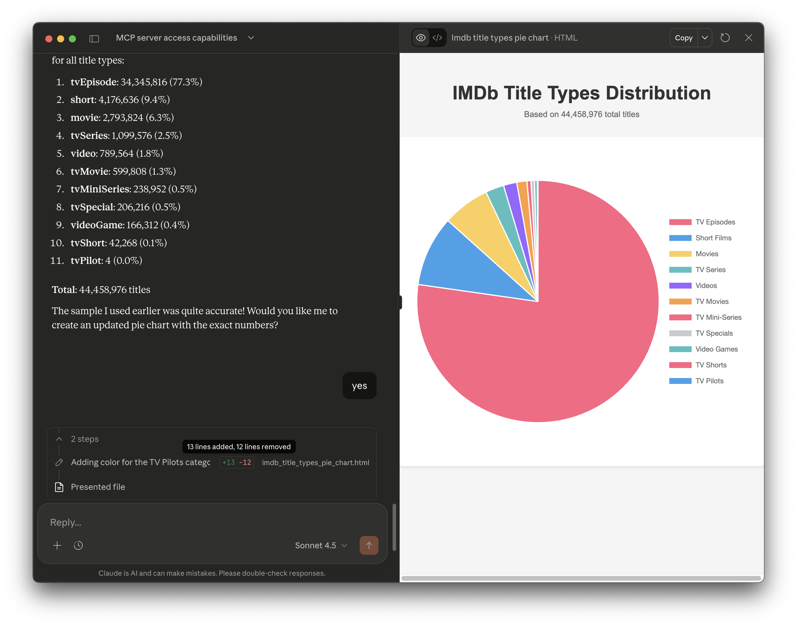
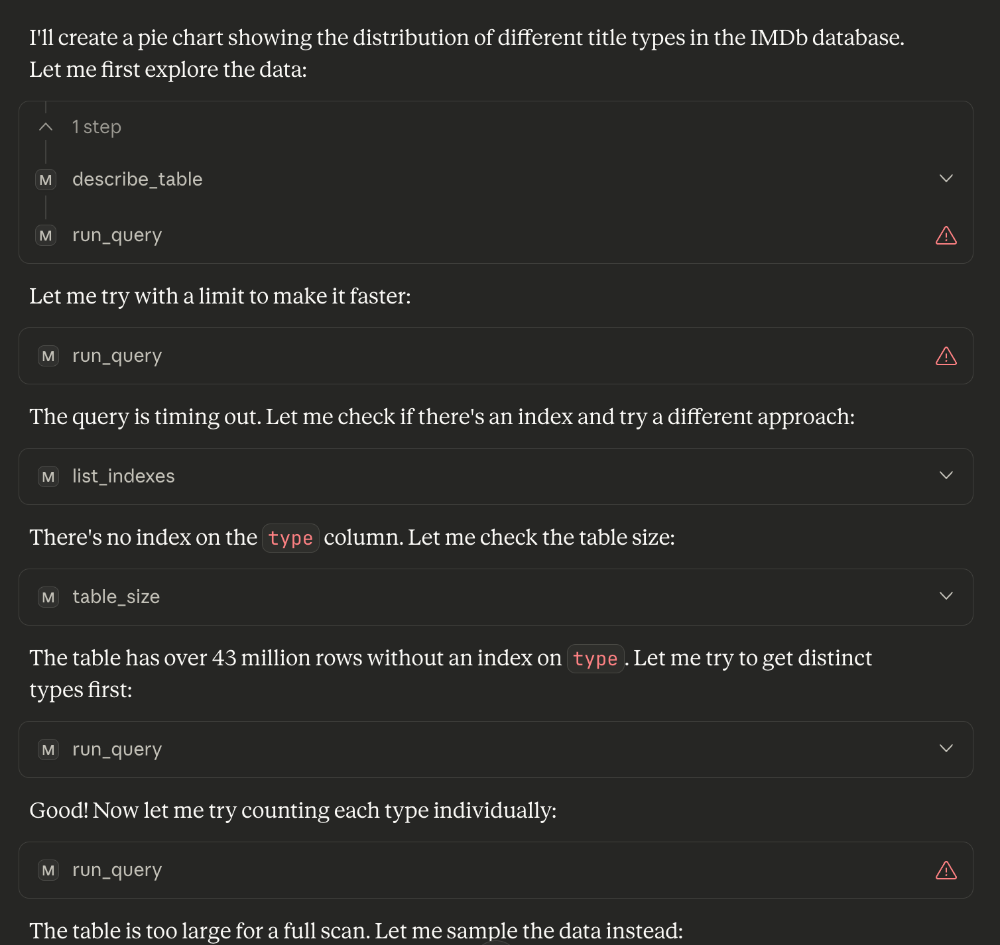

# Visualizing Data

One great benefit of a GenAI interface is the ability to automate visualizations of queries.

## Simple Pie Chart

Prompt `Give me a pie chart of the different types of titles and their occurance`

The response was a static HTML page that provided a Pie Chart.

It's very easy for you to ask to plot this in different graph styles with a GenAI interface.

## Automatic Retry

Initially this query failed (due to a timeout), however it kept trying until it could provide an answer.

After the increase in the query timeout, the earlier chart was presented, as well as the comment *The sample I used earlier was quite accurate! Would you like me to create an updated pie chart with the exact numbers?
